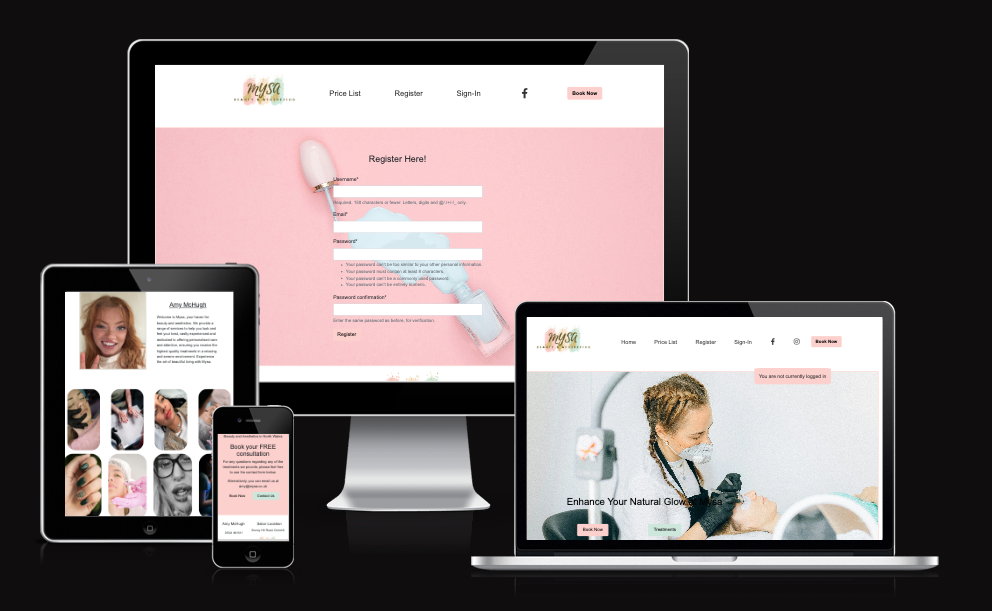
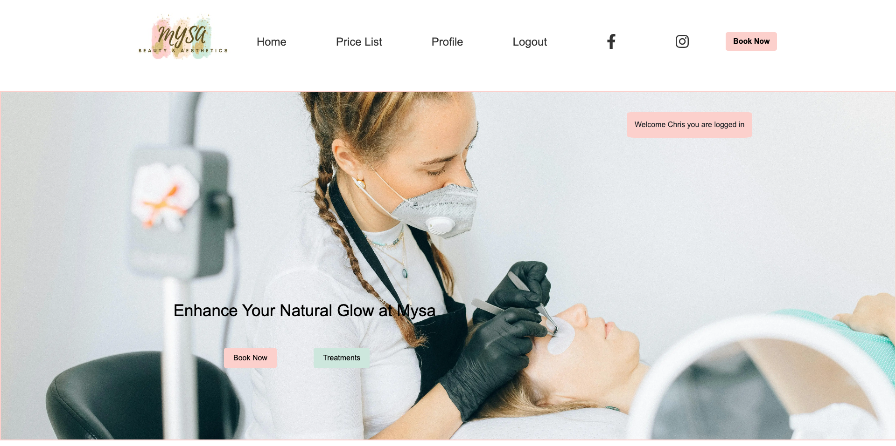
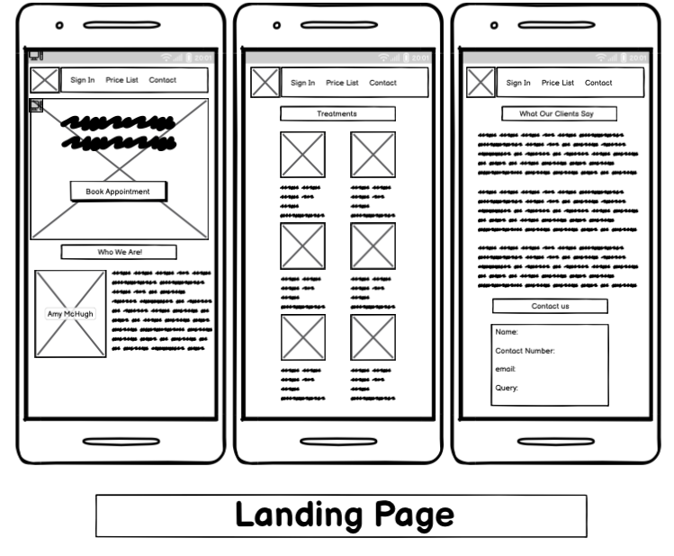
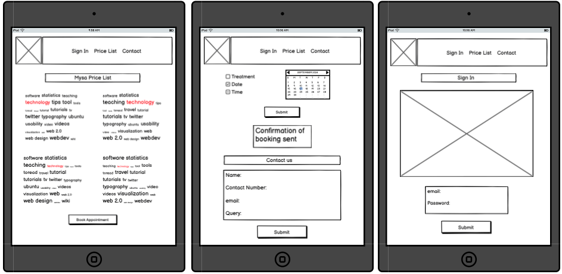
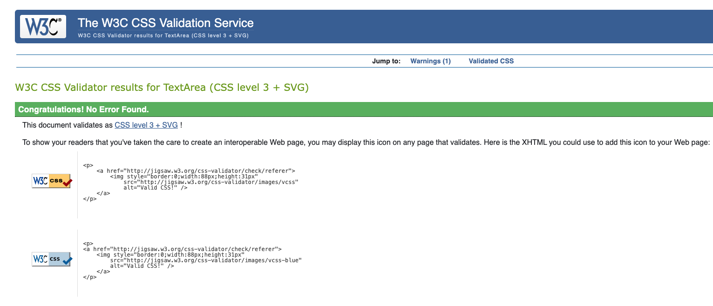

# Mysa

## Description

Mysa - Anagram of 'Amy's' is a Beauty and Aesthetic website for my friend, Amy McHugh. A very talented and experiece therapist, loving mother, who has transformed a barn into a lovely environment that is Mysa.

You can view this site at https://mysa-cbc157c11393.herokuapp.com

## Features

* User registration, sign-in and logout: Simple intuitive pages for both new and previous users.
* Booking page allowing registered users to book treatments at a time/date that suits their availability (depending on salon availability).
* The option to edit or delete bookings should the user wish to change treatment, date or time, or even cancel the booking.

## Home Page

The home page allows users to register an account (or sign in) in order to book, edit or delete a treatment. Price List and Treatment page are to follow at a later date, once included, the user will have the function to view all treatments which will have a detailed description of what they entail, accompanied with a price enabling them to make the right selection when boolking.

Home page also has images showing either finished or treatments in progress a long with multiple 'book now' buttons and alternative methods to contact the salon.

## Wireframes

Wireframes show a clean and simple design to aid user experience.

! [Mobile2](static/assets/images/Mobile2.webp)

! [Tablet1](static/assets/images/Tablet.png)

! [Desktop1](static/assets/images/Desktop1.png)

! [Desktop2](static/assets/images/Desktop2.png)

## User Stories and Bugs

A total of 13 User Stories of which 10 have been implemented. 3 to be added at later date.

##### Completed User Stories

* As a developer, I would like users to have their profile so that they can easily track and manage treatments.
* As a developer, I would like to link the business socail media accounts so my advertising can reach more people.
* As a developer, I would like the business contact information, social media and business logo visible, so they can use alternate methods of contact should the user wish.
* As a developer, I would like the book appointment buttonsto be as visible as possible across all pages, to give the user maximum opportunity to make a booking.
* As a developer, I would like the availabilty times available for users to be booked to match the business opening hours, the time also becomes unavailable once booked to prevent double bookings
* As a developer, I would like to be able to navigate around the site so I can easily findwhat I am looking for.
* As I developer, I can clearly see how and where I can book appointments so that I book a time/date to suit.
* As a user, I would like to see confirmation of my booking request so that I know it has been confirmed.
* As a user, I would like to be able to edit a booking if I need to change the date or time, so that I can still keep an appointment.
* As a user, I would like to be able to delete a booking if I have made it by mistake or can no longer attend.

##### User Stories to be added to the project at a later date

* As a user, I can clearly see what treatments are available so that I know exactly what I am booking.
* As a user, I would like to be able to see how much each individual treatment costs, so that I know which treatment/s I can afford.
* As a user, I would like to be able to contact the business via a contact form so they can answer and questions/queries they may have.

##### Bugs

Lots of bugs encountered, mainly with the booking form using Django/Python. Spelling mistakes and wrong class names was the main issue.

Fixed the drop down menu when in mobile/tablet size. Added z-index to ensure the menu appeared above the hero image instead of behind it.

## Validator Testing

#### CSS

#### HTML

#### Python

! [booking-urls](static/assets/images/booking-urls.png)

#### Lighthouse

Performance is down due to size of image files. These will need to be compressed

! [Lighthouse](static/assets/images/Lighthouse.png)

## Credits
